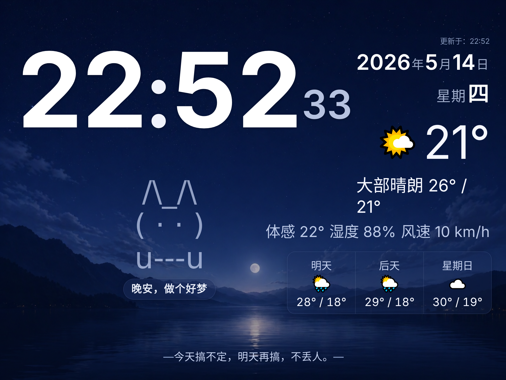

# Living Room Dashboard

客厅大屏页面 — 时钟 + 天气 + ASCII 猫，适配 iPad 壁挂大屏。

## 预览



## 功能

- **实时时钟** — 秒级对齐，页面不可见时暂停省电
- **天气信息** — 调用 Open-Meteo API（无需 API Key），自动定位，失败回退杭州坐标
- **ASCII 猫** — idle / blink / walk 状态机动画
- **问候语** — 按时段展示猫主题中文短句
- **省电休眠** — 凌晨 01:00 ~ 07:30 自动进入休眠（黑色遮罩 + 暂停所有动效）
- **iOS 添加到主屏幕** — 支持 standalone 模式（通过 `/clock/` 路由绕过 WebClip 缓存）

## 使用

```bash
# 本地查看
open index.html

# 静态服务
python3 -m http.server 8080
```

## 部署

生产环境通过 nginx 反代 `python -m http.server 8080`，提供 HTTPS。

| 路由 | 说明 |
|------|------|
| `https://gucx.top/` | 域名访问 |
| `https://IP/clock/` | iOS 主屏幕专用路由，规避 WebClip 缓存问题 |

### iOS 注意事项

从主屏幕打开时，`navigator.geolocation.getCurrentPosition()` 因权限弹窗不显示会永久卡住。已在 `getGeoLocation()` 中通过 `setTimeout 5s` 超时兜底，超时后使用默认坐标。`/clock/` 路由用于绕过 iOS 的独立 WebClip 缓存层。
